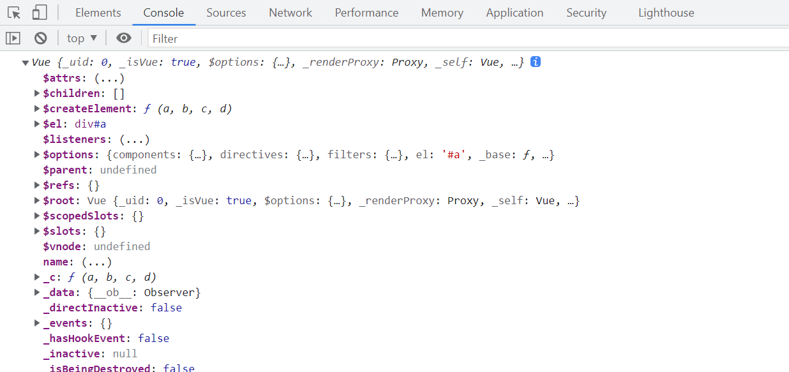

## Vue中的对象和属性

MVVM模型

​      1.M：模型（Model）:data中的数据

​      2.V：视图（View）：模板代码

​      3.VM：视图模型（ViemModel）： Vue实例


观察发现：

​      1.data中所有的属性，最后都出现在了vm身上

​      2.vm身上所有属性 及 Vue 原型上所有属性，在 Vue 模板中都可以直接使用


```
<body>
    <div id="a">
        <p>{{_data}}</p>
        <p>{{$options}}</p>
    </div>
    <script>
        const vm = new Vue({
            el:'#a',
            data:{
                name:"test"
            }
        })
        console.log(vm);
    </script>
</body>
```

