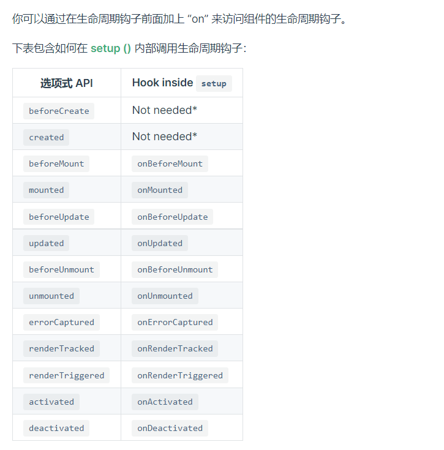
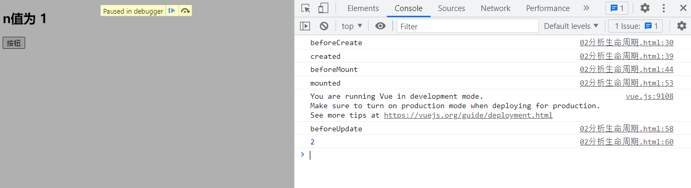
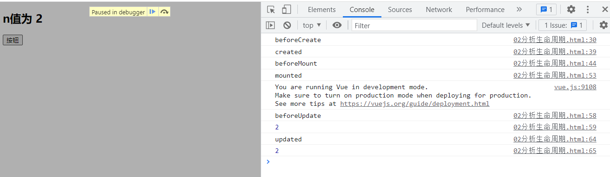

## mounted()

挂载函数使用场景：**vue**完成模板的解析并把**初始的真实**DOM元素放入页面后（挂载完毕）调用

`例子`：当所有内容加载完毕后，调用**计时器**功能

```
    <div id="a">
        <!-- p标签通过Vue绑定的行内样式没有绑定上 -->
        <div :style="{opactiy}">文字，逐帧透明度{{opactiy}}</div>
    </div>s
    <script>
        const vm = new Vue({
            el:'#a',
            data:{
                opactiy:1,
            },
            // mounted()函数使用场景：vue完成模板的解析并把真实的DOM元素放入页面后（挂载完毕）调用
            mounted() {
                setInterval(() => {
                    this.opactiy -= 0.01
                    if(this.opactiy <= 0){
                        this.opactiy = 1;
                    }
                }, 16);
            },
        })
       
    </script>
```


生命周期

1. 又名：生命周期回调函数、生命周期函数、生命周期钩子

2. 生命周期函数的名字不可更改，但函数的具体内容是程序员根据需求编写的

3. 生命周期函数中的`this`指向是`vm`或**组件实例对象**

    

## VM 生命周期的4对8个函数


| 将要创建         | beforeCreate()      |
| ---------------- | ------------------- |
| 创建完毕         | **created()**       |
| 将要挂载         | **beforeMount()**   |
| 挂载完毕（重要） | **mounted()**       |
| 将要更新         | **beforeUpdate()**  |
| 更新完毕         | **updated()**       |
| 将要销毁（重要） | **beforeDestroy()** |
| 销毁完毕         | **destroyed()**     |


## 官网生命周期的函数汇总




### 生命周期前期`挂载`流程

```
    <div id="a">
        <h2>n值为 {{n}}</h2>
        <button  @click="add()">按钮</button>
    </div>
    <script>
        const vm = new Vue({
            el:'#a',
            data:{
                n:1
            },
            methods: {
                add(){
                    this.n++
                },
                
            },
            // beforeCreate() 函数，无法通过 vm 访问到 data 中的数据，methods 中的方法。
            // 初始化：生命周期、事件，但数据代理还未开始
            beforeCreate() {
                console.log('beforeCreate');
                // 查看 this 的指向
                // console.log(this);
                // 断点调试，让代码执行到这一步暂停。
                // debugger;
            },
            // created() 函数，可以通过 vm 
            // 初始化：数据监测、数据代理
            created() {
                console.log('created');
                // console.log(this);
            },
            // beforeMount() 函数，页面呈现的是 未经Vue编译 的DOM结构，目前所有对DOM的操作，最终都不生效，可以从打的断点中看出来。
            beforeMount() {
                console.log('beforeMount');
                // console.log(this);
                // debugger;
            },
            // mounted()函数使用场景：vue完成模板的解析并把初始的真实DOM元素放入页面后（挂载完毕）调用
            // 1、页面中呈现的是 经过Vue编译 的DOM
            // 2、对DOM的操作均有效（但是尽可能避免）
            // 至此，初始化过程结束，一般在此进行：开启定时器、发送网络请求、订阅消息、绑定自定义事件、等初始化操作
            mounted() {
                console.log('mounted');
                debugger;
            },
        })
    </script>
```


### 生命周期`更新`流程


图示：**控制台**值已经发生改变，但是DOM页面中，**n值**还未发生改变




图示：**控制台**值已经发生改变，DOM页面中，**n值**页同步更新




```
    <div id="root">
        <h2>n值为 {{n}}</h2>
        <button  @click="add()">按钮</button>
    </div>
    <script>
        const vm = new Vue({
            el:'#root',
            data:{
                n:1
            },
            methods: {
                add(){
                    this.n++
                },
                
            },
            // beforeCreate() 函数，无法通过 vm 访问到 data 中的数据，methods 中的方法。
            // 初始化：生命周期、事件，但数据代理还未开始
            beforeCreate() {
                console.log('beforeCreate');
                // 查看 this 的指向
                // console.log(this);
                // 断点调试，让代码执行到这一步暂停。
                // debugger;
            },
            // created() 函数，可以通过 vm 
            // 初始化：数据监测、数据代理
            created() {
                console.log('created');
                // console.log(this);
            },
            // beforeMount() 函数，页面呈现的是 未经Vue编译 的DOM结构，目前所有对DOM的操作，最终都不生效，可以从打的断点中看出来。
            beforeMount() {
                console.log('beforeMount');
                // console.log(this);
                // debugger;
            },
            // mounted()函数使用场景：vue完成模板的解析并把初始的真实DOM元素放入页面后（挂载完毕）调用
            // 1、页面中呈现的是 经过Vue编译 的DOM
            // 2、对DOM的操作均有效（但是尽可能避免）
            // 至此，初始化过程结束，一般在此进行：开启定时器、发送网络请求、订阅消息、绑定自定义事件、等初始化操作
            mounted() {
                console.log('mounted');
                // debugger;
            },
            // beforeUpdate() 函数 数据是最新的，但是页面时旧的。（页面和数据未保持同步）
            beforeUpdate() {
                console.log('beforeUpdate');
                console.log(this.n);
                // debugger;
            },
            // updated() 函数 数据是最新的，页面也是最新的。（页面和数据保持了同步）
            updated() {
               console.log('updated');
               console.log(this.n);
               debugger;
            },
        })
    </script>
```


### 生命周期后期`销毁`流程

`when vm.$destroy() is called`		当调用 `vm.$destroy()`函数时，就可以调用`销毁`流程的如下函数。


#### vm.$destroy()

**官网描述**	用法：完全销毁一个实例，清理与其他实例的连接，解绑他的全部指令及事件监听器（**仅限自定义事件**）


​	


## 生命周期`总结`

1. 常用的生命周期钩子：
    1. `mounted()` ：发送`ajax`请求、启动定时器、绑定自定义事件、订阅消息等【初始化操作】
    2. `beforeDestroy()`  : 清楚定时器、解绑自定义事件、取消订阅消息等【收尾工作】
2. 关于销毁 `vue` 实例
    1. 销毁后借助 `vue`开发者工具看不到任何信息
    2. 销毁后自定义事件会**失效**，但原生DOM事件依旧有效
    3. 一般不会在`beforeDestroy()`操作数据，因为机试操作数据，也不会触发更新流程。

```
    <div id="a">
        <!-- p标签通过Vue绑定的行内样式没有绑定上 -->
        <h2 :style="{opactiy}">文字，逐帧透明度{{opactiy}}</h2>
        <button @click="stop()">点击停止数字</button>
    </div>
    <script>
        const vm = new Vue({
            el:'#a',
            data:{
                opactiy:1
            },
            methods: {
                stop(){
                    // 清除定时器销毁，不完全
                    // clearInterval(this.timer);
                    this.$destroy();
                }    
            },
            // mounted()函数使用场景：vue完成模板的解析并把初始的真实DOM元素放入页面后（挂载完毕）调用
            mounted() {
                // this.timer 指向 vue ，就可以用在上面的方法中
                this.timer = setInterval(() => {
                    console.log('setInterval');
                    this.opactiy -= 0.01;
                    if(this.opactiy <= 0){
                        this.opactiy = 1;
                    }
                }, 16);
            },
            beforeDestroy() {
                // 使用上述 beforeDestroy() 函数的特性，清除定时器
                clearInterval(this.timer);
            },
        })
       
    </script>
```

