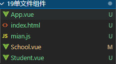

**HTML、js、css**组件化

Vue中使用组件的三大步骤

1. 定义组件（创建组件）

2. 注册组件

3. 使用组件（写组件标签）

    

1. 如何定义一个组件？

    使用`Vue.extend(options)`创建，其中 `options` 和 `Vue(options)`时传入的那个`option`几乎一样，但也有点区别

    区别如下：

    1. 不能写 `el 配`置项，因为最终所有组件都要被一个 VM 管理，由 VM 决定服务与谁

    2. `data`必须写成函数，为什么？ —— 避免组件被复用时，数据存在引用关系

        备注：使用 `template`可以配置组件结构。

2. 如何注册组件

    1. 局部注册：靠 `new Vue`的时候传入 `components`选项
    2. 全局注册：靠 `Vue.component('组件名'，组件)`


## 非单文件组件

### 创建组件


`例子`

```
        // 创建 school 组件
        const school = Vue.extend({
            // 组件定义时，不能写 el 配置项，因为最终所有组件都要被一个 VM 管理，由 VM 决定服务与谁
            template:
            `
            <div>
                <h2>学校名称{{schoolName}}</h2>
                <h2>学校地址{{address}}</h2>
                <button @click='tishi()'>按钮</button>
            </div>
            `
            ,
            data(){
                return{
                    schoolName:'康尔',
                    address:'沣东',
                }
            },
            methods: {
                tishi(){
                    alert(this.schoolName);
                }
            },
        })
```

### 注册组件

#### 局部注册


`例子`

```
        // 创建 vm 实例
        new Vue({
            el:"#a",
            // 绑定组件的关键字，注册组件（局部祖册）
            components:{
                // 组件 ：对应的组件名  （键:键值）
                school:school,
                student:student
            }
        })
```


#### 全局注册


`例子`

```
    <div id="b">
        <!-- 编写组件标签 -->
        <hello></hello>
    </div>

    <script>
        // 创建组件
        const hello = Vue.extend({
            template:`
            <div>
                <h2>你好{{name}}</h2>
            </div>
            `,
            data() {
                return {
                    name:"鱼肚白"
                }
            },
        })
        // 全局组件
        Vue.component('hello',hello);
        // 创建 vm 实例
        new Vue({
            el:'#b',
        })
    </script>
```


### 编写组件标签

`例子`

```
    <div id="a">
        <!-- 编写组件标签 -->
        <school></school>
        <hr>
        <student></student>
        <hr>
        <student></student>
    </div>
```


### 组件需要注意的点

#### 组件的简写形式

```
        // 创建组件的简写形式
        const ab = {
            
        }
```


### 组件的嵌套


`例子`

```
    <div id="a">
        <hello></hello>
    </div>

    <script>
        // 创建 student 组件
        const student = Vue.extend({
            // 组件定义时，不能写 el 配置项，因为最终所有组件都要被一个 VM 管理，由 VM 决定服务与谁
            template:
            `
            <div>
                <h2>学生姓名{{stdnentName}}</h2>
                <h2>学生年龄{{age}}</h2>
            </div>
            `
            ,
            data(){
                return{
                    stdnentName:'zs',
                    age:18
                }
            }
        })

        // 创建组件
        const hello = Vue.extend({
            // name 关键字：设置组件在 vue 中显示的名字
            name:"test",
            template:`
            <div>
                <h2>学校名称{{name}}</h2>
                <h2>学校地址{{address}}</h2>
                <student></student>
            </div>
            `,
            data() {
                return {
                    name:"鱼肚白",
                    address:'天空'
                }
            },
            // 组件嵌套
            components:{
                'student':student
            }
        })
        
        // 创建实例
        new Vue({
            el:'#a',           
            // 局部注册
            components:{
                "hello":hello,
            },
        })
    </script>
```


### 定义app的组件

`例子`

```
    <div id="a">
        <app></app>
    </div>

    <script>
        // 创建 student 组件
        const student = Vue.extend({
            // 组件定义时，不能写 el 配置项，因为最终所有组件都要被一个 VM 管理，由 VM 决定服务与谁
            template:
            `
            <div>
                <h2>学生姓名{{stdnentName}}</h2>
                <h2>学生年龄{{age}}</h2>
            </div>
            `
            ,
            data(){
                return{
                    stdnentName:'zs',
                    age:18
                }
            }
        })

        // 创建组件
        const hello = Vue.extend({
            // name 关键字：设置组件在 vue 中显示的名字
            name:"test",
            template:`
            <div>
                <h2>学校名称{{name}}</h2>
                <h2>学校地址{{address}}</h2>
                <student></student>
            </div>
            `,
            data() {
                return {
                    name:"鱼肚白",
                    address:'天空'
                }
            },
            // 组件嵌套
            components:{
                'student':student
            }
        })
        // 创建一个hello的同级组件
        const hz = Vue.extend({
            template:
            `
            <div>
                <h2>学校名称{{name}}</h2>
                <h2>学校地址{{address}}</h2>
            </div>
            `,
            data() {
                return {
                    name:"华中",
                    address:"华盛顿"
                }
            },
        })
        
        // 定义 app 组件
        const app = Vue.extend({
            template:
            `
            <div>
                <hello></hello> 
                <hz></hz> 
            </div>
            `,
            components:{
                'hello':hello,
                'hz':hz
            }
        })

        // 创建实例
        new Vue({
            el:'#a',           
            // 局部注册
            components:{
                'app':app
                },
        })
    </script>
```


### VueComponent构造函数

关于`VueComponent`

1. `shcool`组件本质是一个名为 `VueComponent`的构造函数，且不是程序员定义的，是 `Vue.extend`生成的

2. 我们只需要写`<school>`或者`<school></school>`，**vue**解析时会帮我们创建`school`组件的实例对象

3. 注意：每次调用 `Vue.extend`,返回的都是一个全新的  `VueComponent`

4. 关于`this`指向

    1. 组件配置中：
        `data`函数、`methods`中的函数、`watch`中的函数、`computed`中的函数 他们的`this`均是【`VueComponent`】

    2. `new Vue(option)`配置中

        `data`函数、`methods`中的函数、`watch`中的函数、`computed`中的函数 他们的`this`时【Vue实例对象】

5. `VueComponent`的实例对象，以后简称 `vc`（也可以称之为：组件的实例对象）

    Vue的实例对象，以后简称`vm`

     

### 内置关系

1. 一个重要的内置关系： `VueComponent.prototype._proto_ === Vue.prototype`
2. 为什么要有这个关系：让**组件实例对象**（`VC`）可以**访问到 `Vue` 原型上的属性、方法**。
    - 组件实例对象：类似一个小型的 `VM`，但是不能写`el`元素

`例子`：基本`js`的原型属性和**隐式**原型属性

```
    <script>
        // 定一个构造函数
        function demo(){
            this.a = 1;
            this.b = 2;
        }
        // 创建一个 Demo 的实例对象
        const d = new demo();

        // 显示原型属性
        console.log(demo.prototype);

        // 隐式原型属性
        console.log(d.__proto__);

        // 通过显示原型属性操作原型对象，追加一个 x 属性，值为 99
        demo.prototype.x = 99;

        console.log('@',d.x);
    </script>
```


## 单文件组件

`vue`文件的基本结构，文件起名**首字母建议大写**

```
<template>
  
</template>

<script>
export default {

}
</script>

<style>

</style>
```




每个页面的功能

- `School.vue`	学校组件
- `Student.vue`  学生组件
- `App.vue` 整合两个组件
- `mian.js` 将 `App.vue`引入
- `index.html`前端页面


`School.vue`

```
<template>
    <!-- 组件结构 -->
    <div class="demo">
        <h2>学校名称{{schoolName}}</h2>
        <h2>学生年龄{{address}}</h2>
    </div>    
</template>

<script>
    // vue文件，组件的简写形式
    export default{
        // 命名规范
        name:'School',
        // 组件定义时，不能写 el 配置项，因为最终所有组件都要被一个 VM 管理，由 VM 决定服务与谁
        data(){
            return{
                schoolName:'上地',
                address:'天堂'
            }
        }
    }


    /* 组件交互的相关代码（数据、方法等等） */
    
    // 创建 student 组件
    /* const student = Vue.extend({
        // 组件定义时，不能写 el 配置项，因为最终所有组件都要被一个 VM 管理，由 VM 决定服务与谁
        data(){
            return{
                stdnentName:'zs',
                age:18
            }
        }
    }) */

    // ES6 暴露
    // export default school
</script>
```


`Student.vue`

```
<template>
    <!-- 组件结构 -->
    <div class="demo">
        <h2>学生姓名{{stdnentName}}</h2>
        <h2>学生年龄{{age}}</h2>
    </div>    
</template>

<script>
    // vue文件，组件的简写形式
    export default{
        // 命名规范
        name:'Student',
        // 组件定义时，不能写 el 配置项，因为最终所有组件都要被一个 VM 管理，由 VM 决定服务与谁
        data(){
            return{
                stdnentName:'zs',
                age:18
            }
        }
    }


    /* 组件交互的相关代码（数据、方法等等） */
    
    // 创建 student 组件
    /* const student = Vue.extend({
        // 组件定义时，不能写 el 配置项，因为最终所有组件都要被一个 VM 管理，由 VM 决定服务与谁
        data(){
            return{
                stdnentName:'zs',
                age:18
            }
        }
    }) */

    // ES6 暴露
    // export default school
</script>

```


`App.vue`

```
<template>
    <div>
        <school></school>
        <student></student>
    </div>
</template>

<script>
    // 引入组件,es6的模块引入
    import School from './School'
    import Student from './Student'

    export default {
        name:"App",
        components:{
            School:'School',
            Student:'Student'
        }
    }
</script>
```


`mian.js`

```
import App from './App.vue'

new Vue({
    el:'#a',
    components:{App},
})
```


`index.html`

```
<!DOCTYPE html>
<html lang="en">
<head>
    <meta charset="UTF-8">
    <meta http-equiv="X-UA-Compatible" content="IE=edge">
    <meta name="viewport" content="width=device-width, initial-scale=1.0">
    <title>Document</title>
    
</head>
<body>
    <div id="a">
        <App></App>
    </div>
    <script src="../js/vue.min.js"></script>
    <!-- 引入App.vue -->
    <script src="./mian.js"></script>
</body>
</html>
```

