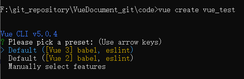
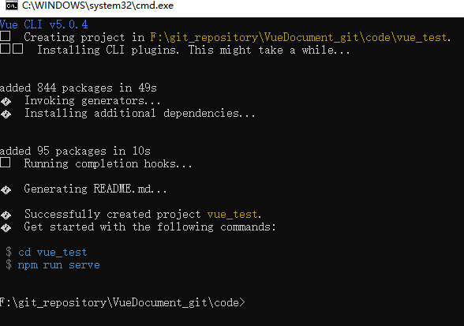
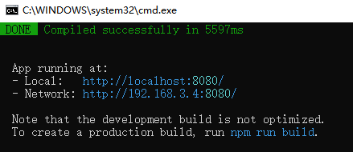
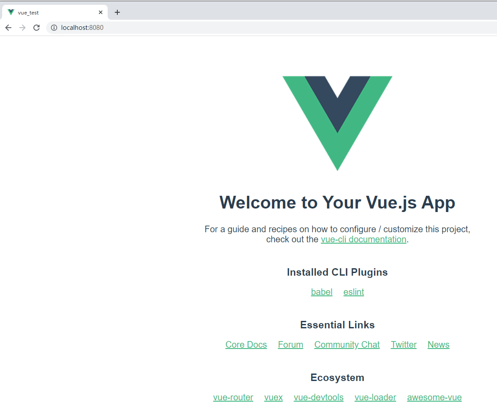
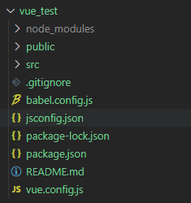

## 初始化脚手架

说明

1. Vue脚手架时`Vue`官方提供的标准化开发工具（开发平台）

2. 最新版本时 4.x

3. `vue-cli`脚手架文档链接 https://cli.vuejs.org/zh/guide/installation.html

    

### 安装脚手架

1. 第一步（仅第一个执行）：全局安装 @vue/cli

    - 可以使用下列任一命令安装这个新的包：

    - ```
        npm install -g @vue/cli
        # OR
        yarn global add @vue/cli
        ```

2. 第二步：**切换到你要创建项目的目录**，然后使用命令行创建项目

    - ```
        vue create vue_test
        ```

    - `vue_test` 为需要创建的文件名

    - 

    - 选择使用 `vue2`版本 还是 `vue3`版本

    - 

    - 脚手架搭建**成功**

    - 进入 `cd vue_test`

    - 执行 `npm run serve`命令让脚手架运行起来

        

        `Network`：同个局域网内其他人访问你的端口

        

        

        **搭建成功**

        

备注：

记得将`npm`换成淘宝镜像源

```
npm config set registry https://registry.npm.taobao.org
```


### 分析脚手架结构

基本结构图片



`.gitignore`：决定哪些文件不想被`git`所管理

`babel.config.js`：**babel**决定`es6`转`es5`的控制


#### src	文件夹

##### main.js	文件

main.js 文件是整个项目的入口文件

```
/* 
    main.js 文件是整个项目的入口文件
*/
// 引入vue
import { createApp } from 'vue'
// 引入 App 组件，他是所有组件的父组件
import App from './App.vue'

// 创建Vue实例对象
createApp(App).mount('#app')
```


##### App.vue文件


##### assets	文件夹

一般情况下，放静态资源


##### components 	文件夹

vue文件的组件


#### public文件夹


##### index.html

文件首页面

```
<!DOCTYPE html>
<html lang="">
  <head>
    <meta charset="utf-8">
    <!-- 针对IE浏览器个一个特殊配置，含义是让IE浏览器以最高的渲染级别进行页面渲染 -->
    <meta http-equiv="X-UA-Compatible" content="IE=edge">
    <!-- 开启移动端的理想视口 -->
    <meta name="viewport" content="width=device-width,initial-scale=1.0">
    <!-- BASE_URL 指 public 对应的路径 -->
    <link rel="icon" href="<%= BASE_URL %>favicon.ico">
    <title><%= htmlWebpackPlugin.options.title %></title>
  </head>
  <body>
    <!-- 当浏览器不支持js时，noscript标签中的文字就会出现在浏览器中 -->
    <noscript>
      <strong>We're sorry but <%= htmlWebpackPlugin.options.title %> doesn't work properly without JavaScript enabled. Please enable it to continue.</strong>
    </noscript>
    <!-- 容器App -->
    <div id="app"></div>
    <!-- built files will be auto injected -->
  </body>
</html>
```

